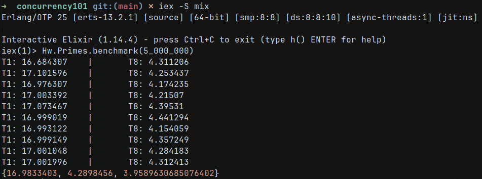

# Concurrency101

## Author:
Joaquín Badillo Granillo

---

## Description:
This repository contains a module to start learning about concurrency in Elixir. The module implements functions to add prime numbers, both sequentially and concurrently to compare the results.

The addition of prime numbers is done checking if each number is prime individually, testing if it is divisible by any number between 2 and its square root. This allows a comparison between sequential and concurrent programs.

---

## Usage
To use this module first install the mix dependencies with the following command:
```
mix deps.get
```
Then to use it interactively run
```
iex -S mix
```
And then you can use the functions in the module, for instance to add the first 1000 primes sequentially use:
```
iex(1)> Hw.Primes.sum_primes(1_000)
```
which should return
```
76127
```

More documentation was generated using docstrings and Hex, it can be consulted visiting the [GitHub Pages](https://joaquinbadillo.github.io/concurrency101/) for this repository or generated after executing `mix docs`. 

---

## Time Complexity
Determining if a number $n$ is prime with the implemented algorithm takes $O\left(\sqrt{n}\right)$ time, since it checks all numbers in the range $[2..\sqrt{n}]$ in the worst case (when it is prime).

Doing this for each number we are adding takes $O\left(n\sqrt{n}\right)$ time, since we are checking all numbers between 2 and $\sqrt{n}$ for each number between 1 and $n$.

This is the asymptotic time complexity of both: the sequential and concurrent implementations, since the number of cores is a constant factor and therefore the order of growth stays the same. However in pracitce the concurrent implementation will feel way faster, since it will reduce the time by a factor of the number of threads.

Something interesting however is that after benchmarking the results, a computer with 8 cores reduced the time by a factor of 4 (not 8). The following image shows the times using 1 thread and 8 threads in a tabular way, followed by a tuple containing the averages of the execution time using 1 core, 8 cores and the speedup. Even when using a number as big as 5 million to test the performance.



This is probably due to the fact that the operative system has to do additional work for threads to be created as well as the process required to split the input for each thread to get a range of numbers. However, as computer hardware becomes harder to improve, using all computer resources at our disposal becomes essential for programmers.